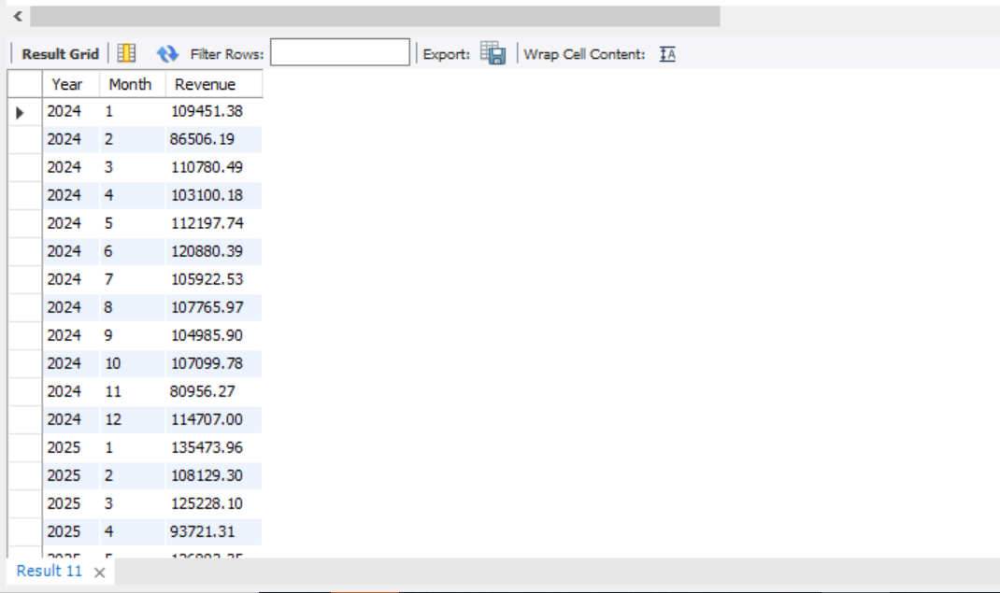
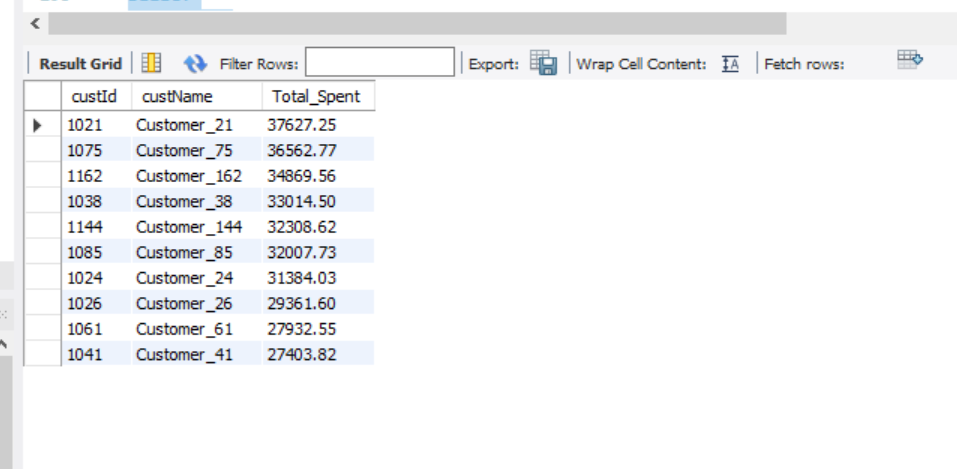
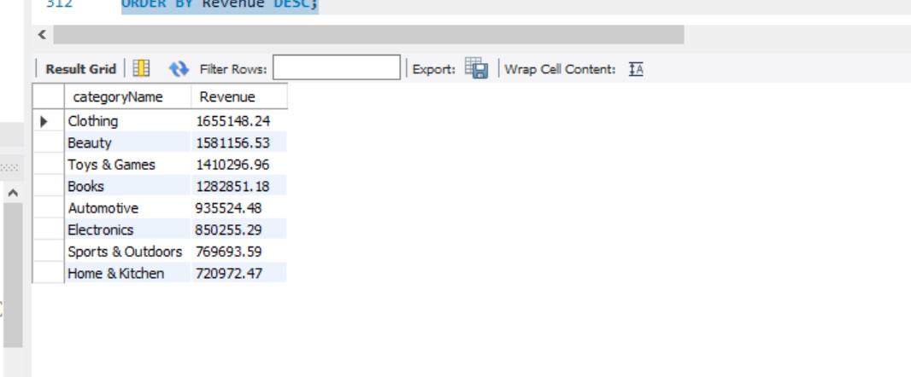
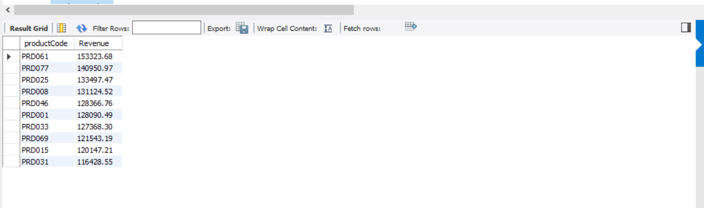
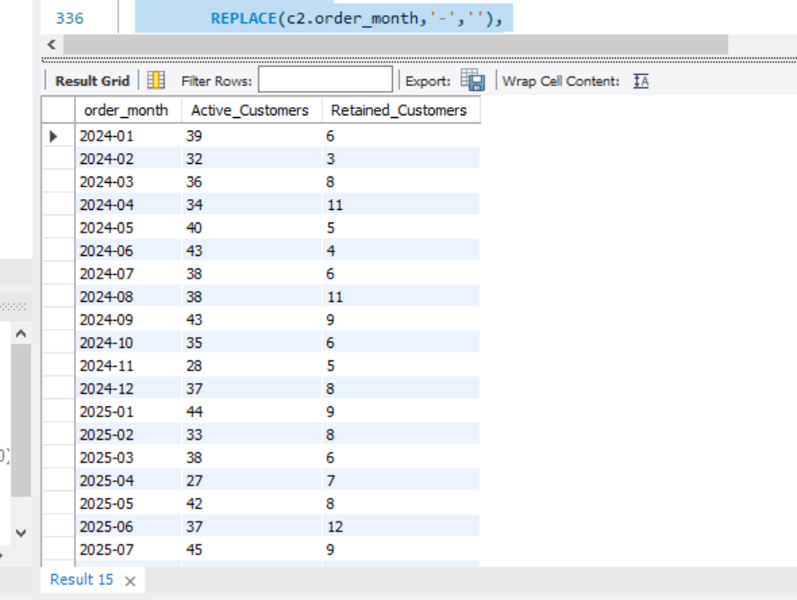
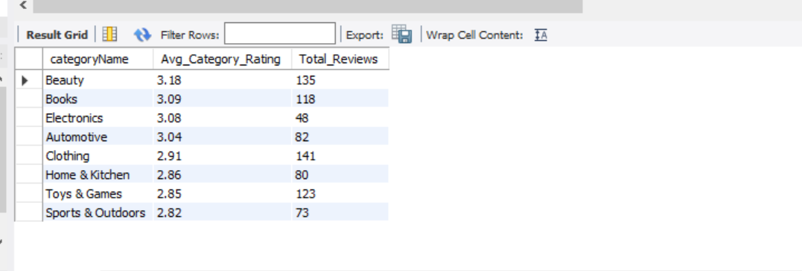
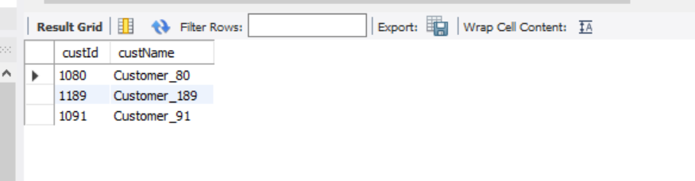

# E-Commerce Sales & Customer Analytics Using SQL

## Project Overview

This project simulates a real-world E-Commerce business environment and demonstrates how SQL can be used to solve business problems and generate actionable insights from transactional data.

The project contains **5,600+ records** distributed across **7 relational tables** and covers:

- Sales Analytics
- Customer Analytics
- Product Analytics
- Category Analytics
- Customer Retention Analysis
- Product Review Analytics
- Cart & Abandoned Cart Analysis

---

## Business Problem

E-commerce companies generate large volumes of transactional data every day. The objective of this project is to analyze customer purchasing behavior, sales performance, product performance, category contribution, customer retention, and shopping cart activity to support data-driven business decisions.

---

## Database Schema

The database consists of 7 relational tables connected using Primary Keys and Foreign Keys.

### Tables Used

| Table | Description |
|---------|-------------|
| Categories | Product category information |
| Products | Product catalog |
| Customers | Customer master data |
| Orders | Customer orders |
| OrderItems | Product-level order details |
| Cart | Shopping cart activity |
| ProductReviews | Product ratings and reviews |

---

## ER Diagram


---

## Dataset Summary

| Table | Records |
|---------|---------:|
| Categories | 8 |
| Products | 100 |
| Customers | 200 |
| Orders | 1,000 |
| OrderItems | 3,000 |
| Cart | 500 |
| ProductReviews | 800 |

### Total Records Analyzed

**5,608+ Records**

---

## SQL Concepts Used

### SQL Fundamentals

- SELECT
- WHERE
- ORDER BY
- GROUP BY
- HAVING
- Aggregate Functions

### Intermediate SQL

- INNER JOIN
- LEFT JOIN
- Subqueries
- CASE Statements
- Date Functions

### Advanced SQL

- Common Table Expressions (CTEs)
- Window Functions
- Ranking Functions
- Customer Retention Analysis
- Revenue Analytics
- Business KPI Reporting

---

# Business Questions Solved

### Sales Analytics

- What is the total revenue generated?
- What is the monthly sales trend?
- Which month generated the highest revenue?
- What is the average order value?

### Customer Analytics

- Who are the top spending customers?
- Which customers are repeat buyers?
- What is the customer retention trend?
- Which city contributes the most customers?

### Product Analytics

- Which products generate the highest revenue?
- Which products sell the most units?
- Which products have never been ordered?

### Category Analytics

- Which category generates the highest revenue?
- Which category contributes the highest sales volume?

### Review Analytics

- Which categories receive the highest ratings?
- Which categories receive the lowest ratings?

### Cart Analytics

- Which customers abandoned their carts?
- What is the potential revenue loss from abandoned carts?

---

# Query Output Screenshots

---

## Monthly Revenue Trend Analysis

### Business Question

How has revenue changed over time?

### Key Insights

- Revenue increased significantly during 2025.
- December 2025 generated the highest revenue.
- Seasonal revenue spikes were observed during year-end periods.

### Output



---

## Top 10 Customers by Spending

### Business Question

Who are the highest-value customers?

### Key Insights

- Customer_21 generated the highest revenue.
- Top customers contributed a significant share of total sales.
- High-value customers can be targeted through loyalty programs.

### Output



---

## Revenue Contribution by Category

### Business Question

Which categories generate the highest revenue?

### Key Insights

- Clothing generated the highest revenue.
- Beauty and Toys & Games were among the top-performing categories.
- Home & Kitchen generated the lowest revenue.

### Output



---

## Top Products by Revenue

### Business Question

Which products generate the highest revenue?

### Key Insights

- PRD061 generated the highest revenue.
- Revenue is concentrated among a small group of products.
- Top-performing products should be prioritized in promotions and inventory planning.

### Output



---

## Monthly Customer Retention Analysis

### Business Question

How many customers return and purchase again?

### Key Insights

- Customer retention remained relatively stable throughout the analysis period.
- June 2025 recorded the highest retained customer count.
- Repeat purchases contributed significantly to monthly activity.

### Output



---

## Category-wise Product Ratings Analysis

### Business Question

Which categories receive the highest customer ratings?

### Key Insights

- Beauty received the highest average rating.
- Books and Electronics maintained ratings above 3.0.
- Sports & Outdoors received the lowest average rating.

### Output



---

## Customers with Abandoned Carts

### Business Question

Which customers added products to cart but did not complete a purchase?

### Key Insights

- Multiple customers abandoned their carts before checkout.
- Abandoned carts represent potential lost revenue.
- Retargeting campaigns can help recover these sales.

### Output



---

# Project Structure

```text
ecommerce-sales-customer-analytics
│
├── database_schema.sql
├── data_generator.sql
├── queries.sql
├── README.md
├── ERD.png
│
└── screenshots
    ├── monthly_revenue_trend.png
    ├── top_10_customers_by_spending.png
    ├── revenue_by_category.png
    ├── top_products_by_revenue.png
    ├── monthly_customer_retention.png
    ├── category_wise_product_ratings.png
    └── customers_with_abandoned_carts.png
```

---

# Tools Used

- MySQL
- MySQL Workbench
- SQL
- GitHub

---

# Key Business Insights Generated

- Identified top-performing products and categories.
- Tracked monthly revenue growth trends.
- Analyzed customer retention and repeat purchase behavior.
- Identified high-value customers.
- Evaluated category-wise customer satisfaction.
- Detected customers with abandoned carts.
- Generated actionable business recommendations through SQL analytics.


## Author

**Vrushab Das**

Data Analyst Portfolio Project
